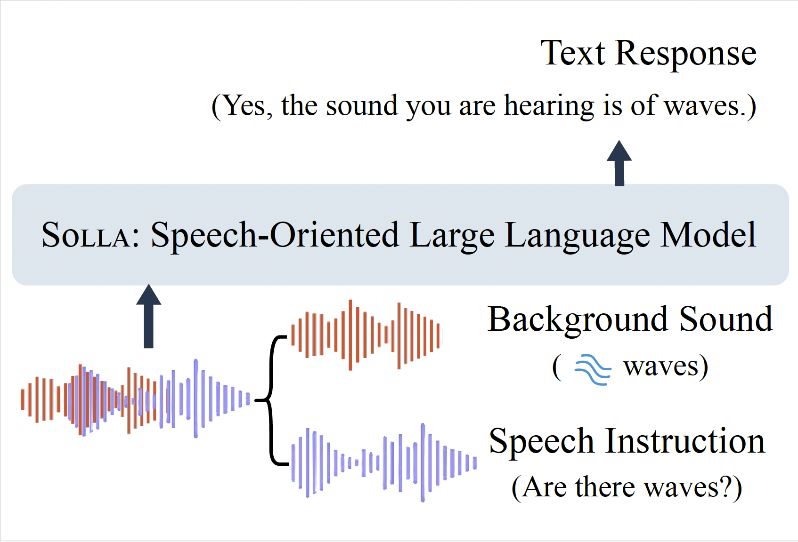

# Solla : Towards a Speech-Oriented LLM That Hears Acoustic Context

LLMs have recently shown remarkable ability to process not only text but also multimodal inputs such as speech and audio.
However, most existing models primarily focus on analyzing input signals using text instructions, overlooking scenarios in which speech instructions and audio are mixed and serve as inputs to the model.

To evaluate the models under this scenario, we propose SA-Eval, which includes three tasks: audio event classification, audio captioning, and audio question answering.
SA-Eval has diverse speech instruction with various speaking styles, encompassing two difficulty levels, *easy* and *hard*, to capture the range of real-world acoustic conditions.

The SA-Eval dataset will be released upon the publication of the paper.
